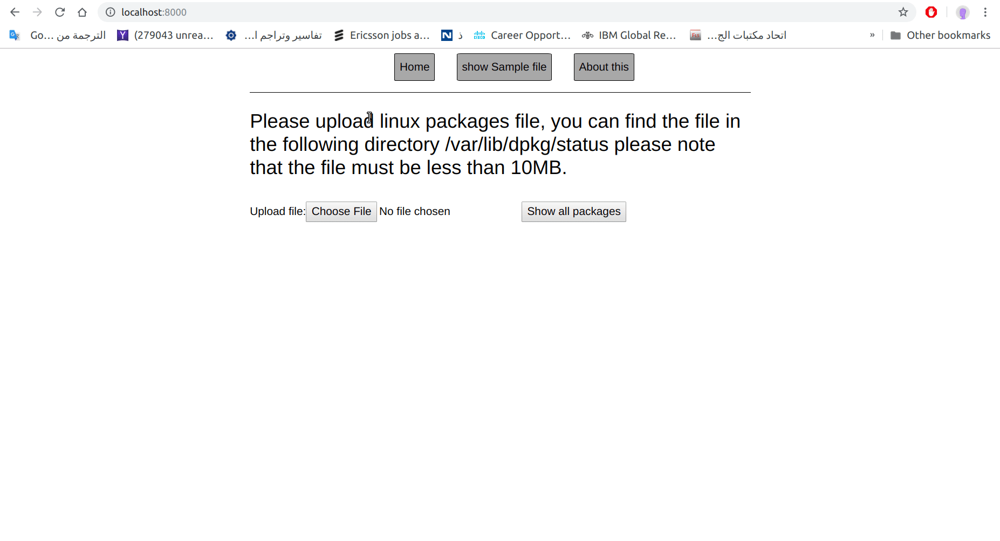

# packages_exercise

This is a quick exercise, it enables you to check the contents of all the packages installed in your linux debian distribution which can be found in 
/var/lib/dpkg/status
if you get the this file, upload it to the app you will be able to navigate through your packages, see each package name, description, dependencies and what this package depends on. 

In this app I used Django framework to build the webserver and the backend.

In case this App is online http://packages-lister.herokuapp.com  but in case I took it down at some point, Here is some screen shots of what you can do with it.

